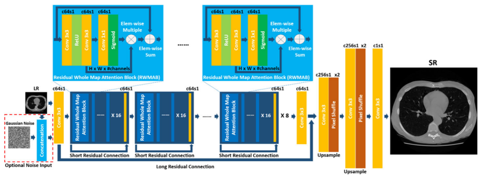
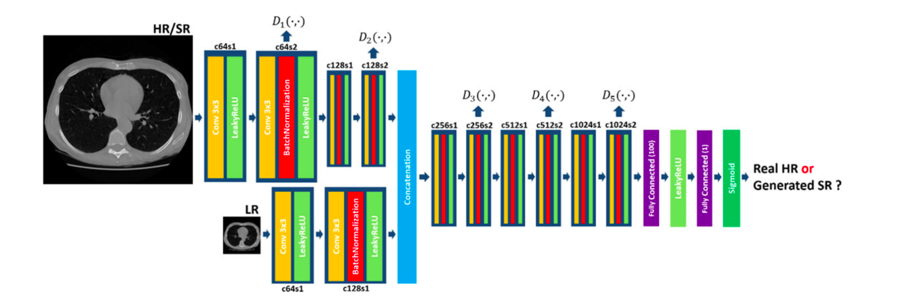

# MedSRGAN
## PyTorch implementation of "MedSRGAN: medical images super-resolution using generative adversarial networks"

</img>
</img>

```python
import torch
from generator import Generator
from discriminator import Discriminator

generator = Generator(
      in_channels= 3,
      blocks= 8
)

discriminator = Discriminator(
      in_channels= 3, 
      img_size= (256, 256)
)
```

### **Using the App**

To use the app, follow these steps:

1. Create the **`genModel`** and **`discModel`** folders in your project directory.
2. Update the path in the **`trainer.py`** file with our custom data and also in **`dataset.py`** to output augmented
3. Run the following command in the terminal to train the model:
    
    ```bash
    python trainer.py
    ```
    
    This will train the MedSRGAN model using your medical image dataset. Adjust the hyperparameters in the **`trainer.py`** file as needed.
    
4. After training, you can test the model on new images using:
    
    ```bash
    python tester.py
    ```
    
    Make sure to input the path of the test image when prompted.
